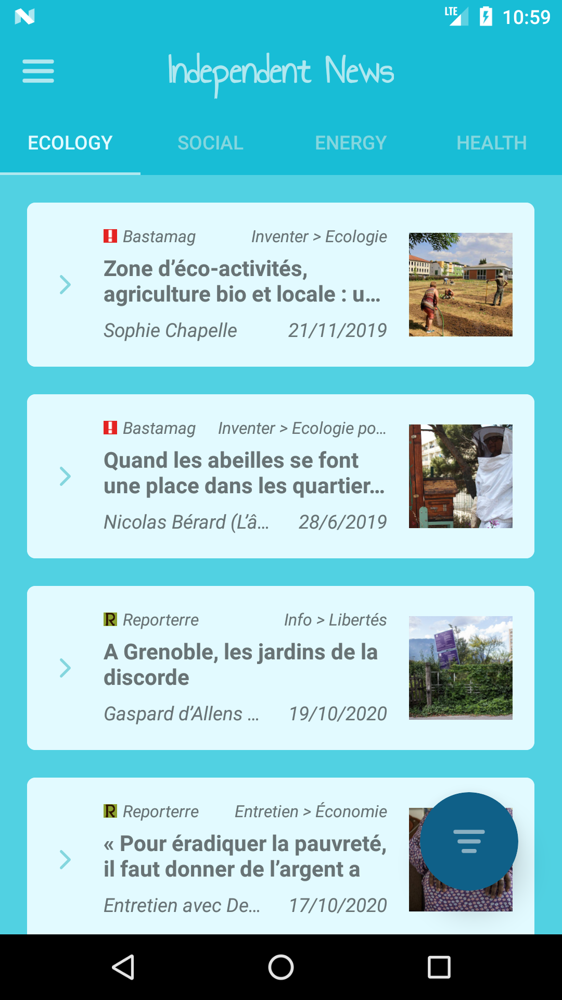
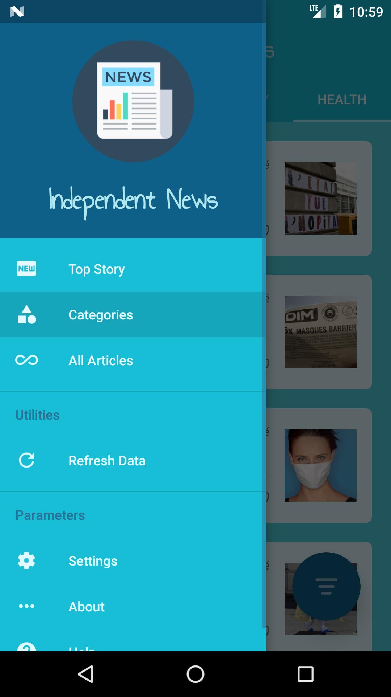

<h2 align="center"><b>Independent News</b></h2>
<h4 align="center">Un logiciel libre, léger, regroupant des journaux indépendants pour Android.</h4>

<h4 align="center>Bientôt sur Google Play Store et F-Droid !</h4>

<a href="#screenshots">Screenshots</a> &bull; <a href="#description">Description</a>
 &bull; <a href="#fonctionnalités">Fonctionnalités</a> &bull; <a href="#mises%20à%20jours">Mises à jours</a> &bull; <a href="#contribution">Contribution</a>
 &bull; <a href="#dons">Dons</a> &bull; <a href="#licence">Licence</a>

*Lire dans une autre langue: [English](README.md), [Français](README.fr.md).*

<b>ATTENTION: CECI EST UNE VERSION BÊTA, PAR CONSÉQUENT VOUS POUVEZ RENCONTRER DES BUGS. SI CELA VOUS ARRIVE, MERCI D'OUVRIR UNE ISSUE SUR NOTRE DÉPÔT GITHUB.</b>

## Screenshots

## Description

Independent News est une Application Android qui propose des articles de qualité provenant de multiples médias français indépendants, c'est une liste non exhaustive.
De nos jours, il est très difficile d'avoir accès à des informations de qualité, c'est pour cela que cette application travail à vous en fournir. Ce qui répond à un besoin important de la communauté et de la démocratie : Des Informations Libres !
Pour cela, toutes les sources contenu dans Independent News ont été préalablement analysé par notre équipe, et doivent respecter plusieurs points :

* Une ligne éditoriale libre
* Pas de publicité
* Pas de conflit d'intérêt
* Intérêt pour la liberté
* Intérêt pour l'écologie

Independent News n'utilise aucun service Google. Les sites web sont analysés uniquement pour récupérer les informations nécessaires,
cette application peut donc être utilisée sur des périphériques n'ayant pas les services Google installés. De plus, vous n'avez pas besoin de compte pour utiliser Independent News, qui est un logiciel complètement libre.

### Fonctionnalités

* Rechercher des articles
* Affiche les information générales de l'article
* Plusieurs listes d'articles (à la une, par catégories, tous les articles)
* Accès direct aux articles pour les lire
* Partager un articles à ses amis
* Redirection depuis les articles (navigation web)
* Afficher les images en plein écran (toutes les gestures disponibles)
* Streaming audio (dans les articles)
* Streaming vidéo (dans les articles)
* Filtrer la liste d'articles (source, thème, catégorie, date)
* Rafraîchissement automatique et/ou manuel des données
* Informations concernant les sources (ligne éditoriale, équipe, conditions d'utilisation...)
* Activer/désactiver une/des source(s)
* Qui possède les médias français les plus importants?
* Notifications quotidiennes

## Mises à jours

Quand une amélioration dans le code d'Independent News est effectuée (ajout de fonctionnalité ou correction de bug), une nouvelle version est éventuellement publié. Cette version sera ua format x.xx.x . Pour obtenir cette nouvelle version, vous pouvez:
 1. Compiler la version debug de l'application vous même. C'est la façon la plus rapide pour bénéficier des dernières fonctionnalités sur votre téléphone, mais c'est la plus compliqué, nous vous recommandons donc d'utiliser l'une des autres méthodes.
 2. *(Bientôt disponible)* Ajoutez notre canal bêta sur F-Droid et installez la dernière version disponible depuis ce canal dès que nous en publions une nouvelle version.
 3. Téléchargez l'APK depuis le [Github Releases](https://github.com/desperu/IndependentNews/releases) et installez la dès que nous publions une nouvelle version.
 4. *(Bientôt disponible)* Mettez à jours depuis F-Droid. C'est la méthode la plus lente pour avoir les mises à jours, comme F-Droid doit s'apercevoir des changements, compiler l'application eux même, la signer et ensuite l'envoyer aux utilisateurs.
 5. *(Bientôt disponible)* Mettez à jours depuis Google Play Store. C'est la méthode la plus lente pour avoir les mises à jours, comme Google Play Store doit s'apercevoir des changements, compiler l'application eux même, la signer et ensuite l'envoyer aux utilisateurs.

Nous vous recommendons la méthode 2 pour la majorité des utilisateurs. Les APK installez avec la méthode 2 ou 3 sont compatibles avec toutes les autres, sauf avec les méthodes 4 et 5. Ceci est dû au fait que nous utilisons la même clé pour signez les APK des méthodes 2 et 3,
mais une clé différente (F-Droid) est utilisé pour la method 4, de même pour la méthode 5 (Google Play Store). Compiler une version debug de l'APK avec la méthode 1 exclus l'utilisation de clé. La signature par clé permet d'éviter l'installation d'une mise à jours frauduleuse de l'application.

## Contribution

Si vous avez des idées, l'envie de traduire, d'améliorer le design, de perfectionner le code, ou d'ajouter une/des fonctionnalités, toute aide est la bienvenu.
Le plus gros est fait, le meilleur est à venir!

## Dons

Si vous aimez Independent News, nous serions heureux de recevoir un don de votre part. Vous pouvez directement envoyer votre don aux médias indépendants. Pour cela, rendez-vous sur la page de don de leur site web.

* [Basta ! donation](https://www.bastamag.net/don)
* [Reporterre](https://reporterre.net/spip.php?page=don)

Dans les prochaines mises à jours, nous prévoyons d'ajouter un système de dons global, pour touts les médias indépendants, directement depuis l'application.

## Données Personnels

Le projet Independent News vise à fournir une expérience privé et anonyme lors de l'utilisation de médias provenant de services web.
Par conséquent, l'application ne collecte aucunes données personnels sans votre consentement.

## Licence

  

Independent News est un logiciel libre: Vous pouvez l'utiliser, l'étudier, le partager et l'améliorer
comme vous le souhaitez. Plus précisément, vous pouvez le redistribuer et/ou le modifier en respectant
les closes de [GNU General Public License](https://www.gnu.org/licenses/gpl.html) comme indiqué par
la Fondation des Logiciels Libres (Free Software Foundation), jusqu'à la version 3 de la Licence, ou
(si vous le souhaitez) toutes les versions supérieurs.