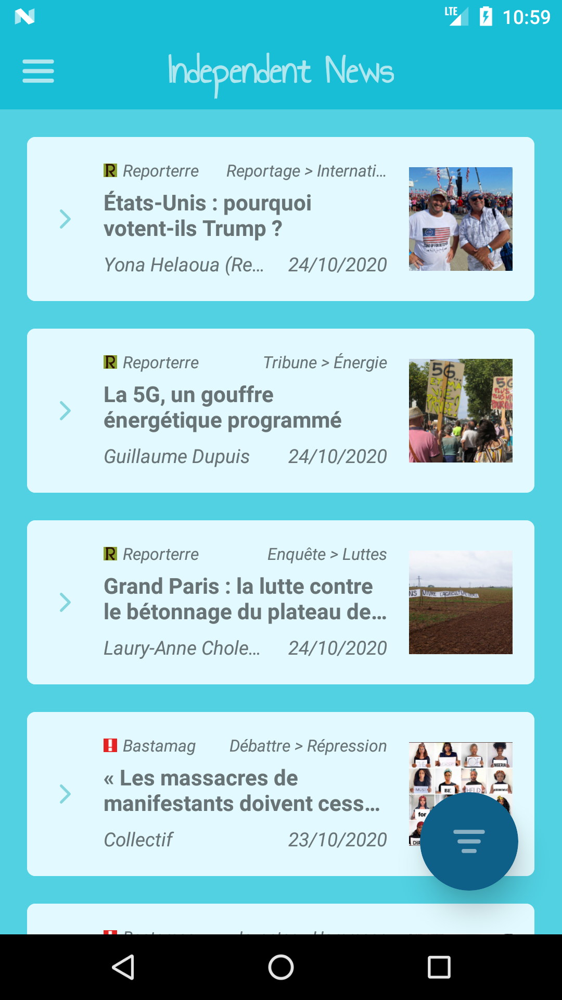
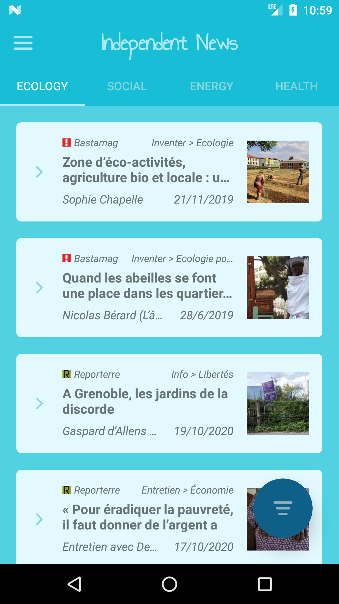
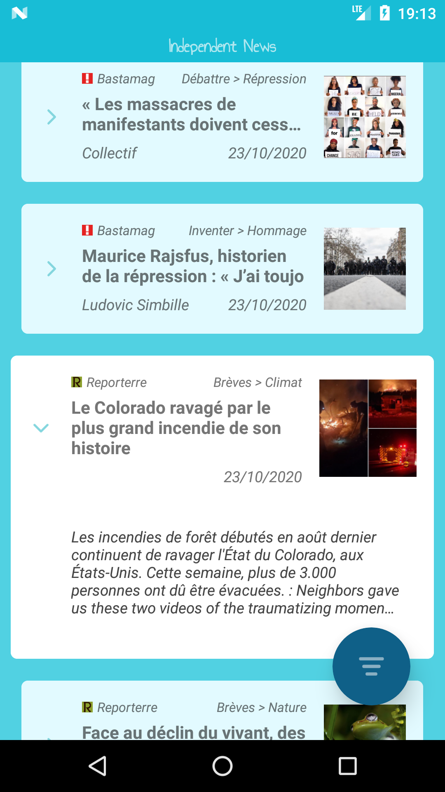
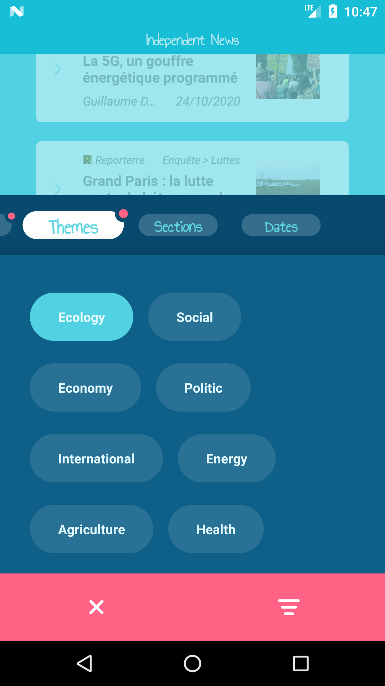
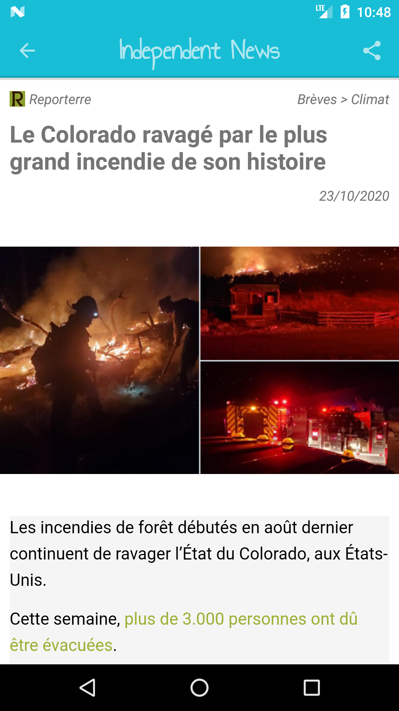
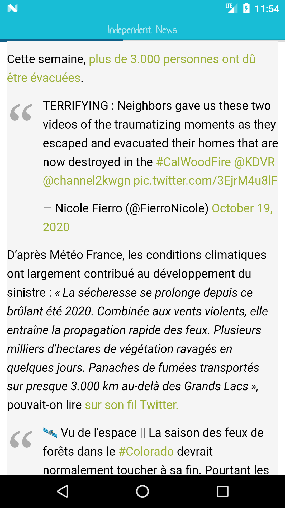
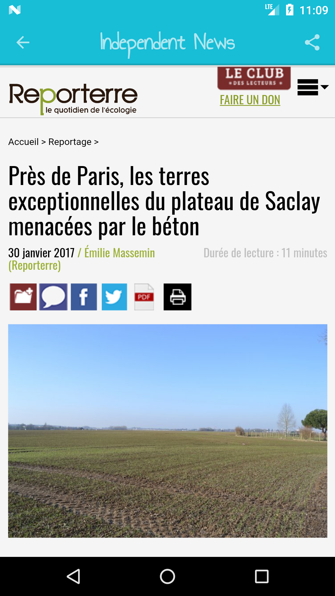
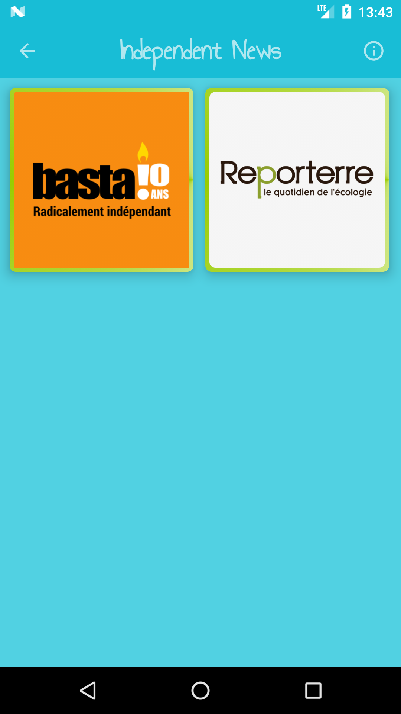
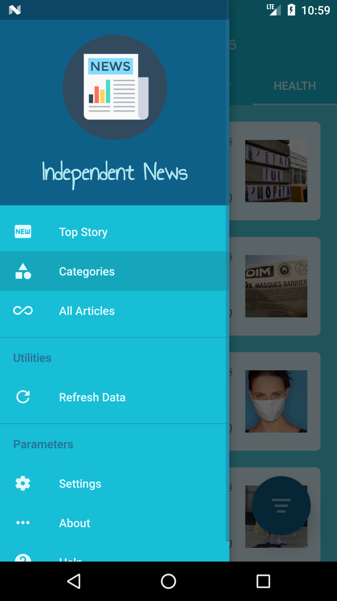
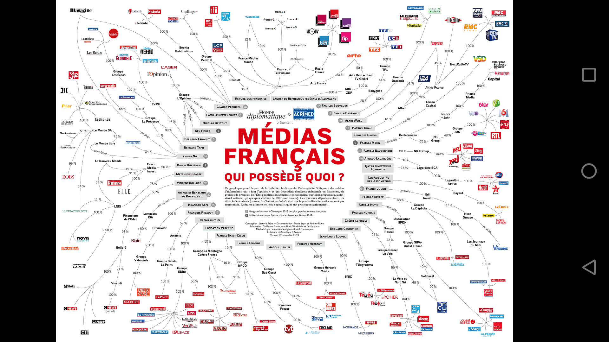

<h2 align="center"><b>Independent News</b></h2>
<h4 align="center">A free lightweight list of independent news for Android.</h4>

<b>Nearly on the Google Play Store and F-Droid !</b>

    

<!--

-->

<a href="#screenshots">Screenshots</a> &bull; <a href="#description">Description</a>
 &bull; <a href="#features">Features</a> &bull; <a href="#updates">Updates</a>
 &bull; <a href="#contribution">Contribution</a> &bull; <a href="#donate">Donate</a> &bull; <a href="#license">License</a>

 

*Read this in other languages: [English](README.md), [Français](README.fr.md).*

<b>WARNING: THIS IS A BETA VERSION, THEREFORE YOU MAY ENCOUNTER BUGS. IF YOU DO, OPEN AN ISSUE VIA OUR GITHUB REPOSITORY.</b>

## Screenshots

## Description

Independent News is an Android Application that's provide quality articles from multiples french independent (free) medias, a non exhaustive list of.
These days, it's really hard to be able to access quality informations, so this application try to help for that. That's answer at an important community and democratic need : Independent Informations!
For that, all included sources in Independent News were parsed from our teams, and must check some needed points :

* Free editorial ligne
* No publicity
* No interest conflict
* Freedom sensibility
* Ecology sensibility

Independent News does not use any Google framework libraries. Websites are only parsed to fetch required info, so this app can be used on devices without Google services installed.
Also, you don't need account to use Independent News, which is complete free software.

### Features

* Search articles
* Display general info about articles
* Different articles list (top stories, categories, all)
* Direct articles access to read them
* Share articles to friends
* Articles link redirection (web navigation)
* Show images in full screen (full gestures support)
* Audio streaming (into articles)
* Video streaming (into articles)
* Filter articles list (source, theme, section and date)
* Auto/manually refresh article list
* Sources informations (vision, team, terms...)
* Enable/disable sources
* Most important french medias majority shareholder (Who owns what ?)
* Daily notifications

## Updates

When a change to the Independent News code occurs (due to either adding features or bug fixing), eventually a release will occur. These are in the format x.xx.x . In order to get this new version, you can:
 1. Build a debug APK yourself. This is the fastest way to get new features on your device, but is much more complicated, so we recommend using one of the other methods.
 2. *(Nearly available)*  Add our custom repo to F-Droid and install it from there as soon as we publish a release. <!-- TODO add doc for F-Droid beta repo, in french too -->
 3. Download the APK from [Github Releases](https://github.com/desperu/IndependentNews/releases) and install it as soon as we publish a release.
 4. *(Nearly available)* Update via F-droid. This is the slowest method of getting updates, as F-Droid must recognize changes, build the APK itself, sign it, then push the update to users.
 5. *(Nearly available)* Update via Google Play Store. This is the slowest method of getting updates, as Google Play Store must recognize changes, build the APK itself, sign it, then push the update to users.

We recommend method 2 for most users. APKs installed using method 2 or 3 are compatible with each other, but not with those installed using method 4.
This is due to the same signing key (ours) being used for 2 and 3, but a different signing key (F-Droid's) being used for 4.
Building a debug APK using method 1 excludes a key entirely. Signing keys help ensure that a user isn't tricked into installing a malicious update to an app.

## Contribution

Whether you have ideas, translations, design changes, code cleaning, or real heavy code changes, help is always welcome.
The more is done the better it gets!

## Donate

If you like Independent News we'd be happy about a donation. You can send your donation directly to the independent newspapers sources. So refers to their web site donate page.

* [Basta !](https://www.bastamag.net/don)
* [Reporterre](https://reporterre.net/spip.php?page=don)

In future update, we will add a global donation feature, for all sources, directly into the application.

## Privacy Policy

The Independent News project aims to provide a private, anonymous experience for using media web services.
Therefore, the app does not collect any personal data without your consent.

## License

  

Independent News is Free Software: You can use, study share and improve it at your
will. Specifically you can redistribute and/or modify it under the terms of the
[GNU General Public License](https://www.gnu.org/licenses/gpl.html) as
published by the Free Software Foundation, either version 3 of the License, or
(at your option) any later version.